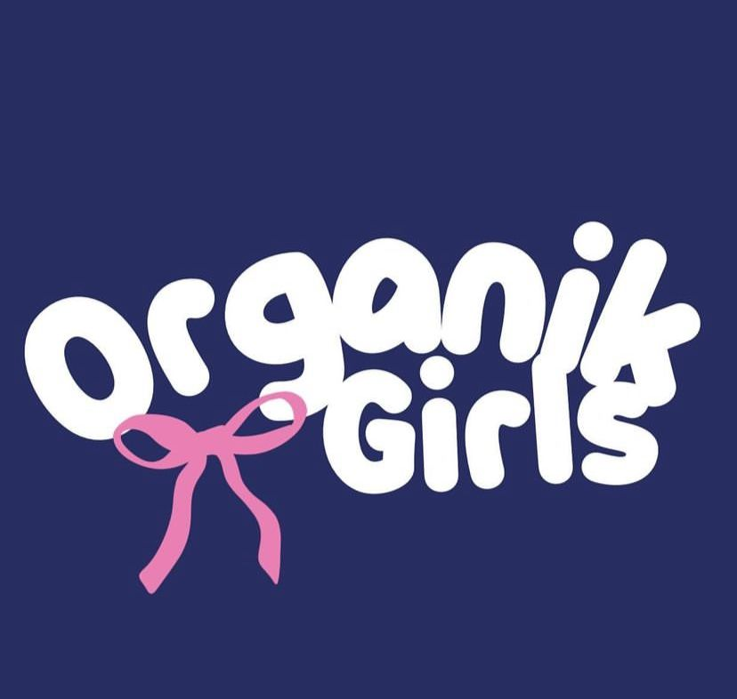

  

# Organiks Girls Netball Team Management App

A full-featured mobile application built for the **Organiks Girls**, a real community netball team in Malaysia. Replaces fragmented tools (WhatsApp groups, spreadsheets, manual records) with a single, role-based platform for players, coaches, and team managers.

Built as my Final Year Project (FYP) at Malaysia-Japan International Institute of Technology (MJIIT).

---

## The Problem

Like most community sports teams, Organiks Girls managed everything manually — match schedules in WhatsApp, player stats in notebooks, rosters on spreadsheets. This caused:

- Missed announcements and scheduling conflicts
- No way to track player performance over time
- Data scattered across multiple apps with no single source of truth

---

## What I Built

A cross-platform mobile app (Android & iOS) with role-specific dashboards for three user types:

| Role | Key Access |
|------|-----------|
| **Coach** | Full team management, match scheduling, performance analytics, strategy planning |
| **Player** | Personal profile, match schedule, performance stats, social feed |
| **Manager** | Roster management, event coordination, communication tools |

### Core Features

- **Match Scheduling** — create, update, and notify the team of upcoming games
- **Player Profile Management** — positions, roles, attendance history
- **Performance Analytics** — track individual and team stats over time
- **Real-time Communication** — in-app posts and announcements via Firebase Cloud Messaging
- **Social Feed** — team updates, milestones, and match results in one place

---

## Tech Stack

| Layer | Technology |
|-------|-----------|
| Frontend | Flutter (Dart) |
| Backend | Firebase (Firestore, Authentication, Cloud Functions) |
| Push Notifications | Firebase Cloud Messaging (FCM) |
| Deployment | Google Play Console |
| Version Control | GitHub |

---

## Methodology

Used a **Hybrid Waterfall-Agile** approach:
- Waterfall for structured requirements gathering and system design (ERD, UML, wireframes)
- Agile sprints for iterative development and continuous stakeholder feedback

Development was split into 3 sprints: scheduling module → communication features → performance tracking.

---

## Testing & Results

| Test Type | Result |
|-----------|--------|
| Black-box testing | ✅ 100% pass rate across all key modules |
| User Acceptance Testing (UAT) | ✅ High user satisfaction |
| Usability Testing | ✅ Positive feedback from coaches and players |

**Measurable outcomes:**
- Reduced average scheduling time significantly
- Eliminated data fragmentation across multiple apps
- Stakeholders confirmed improved coordination and performance tracking

---

## What I Learned

- Building for **real users** — working directly with the Organiks Girls coaching staff shaped every design decision
- **Role-based architecture** in Flutter + Firebase — structuring Firestore rules and UI flows around three distinct user types
- **FCM push notifications** for real-time team updates
- Balancing structured planning (Waterfall) with agile iteration in a solo project

---

## About

**Muhammad Iqrammullah Bin Dollah**  
BSc Computer Science · Malaysia-Japan International Institute of Technology  
[LinkedIn](#) · [GitHub](#) · [Email](#)
